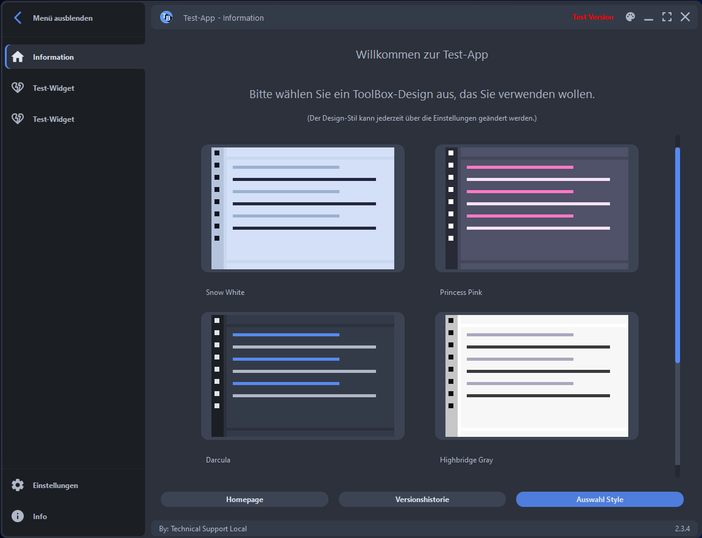
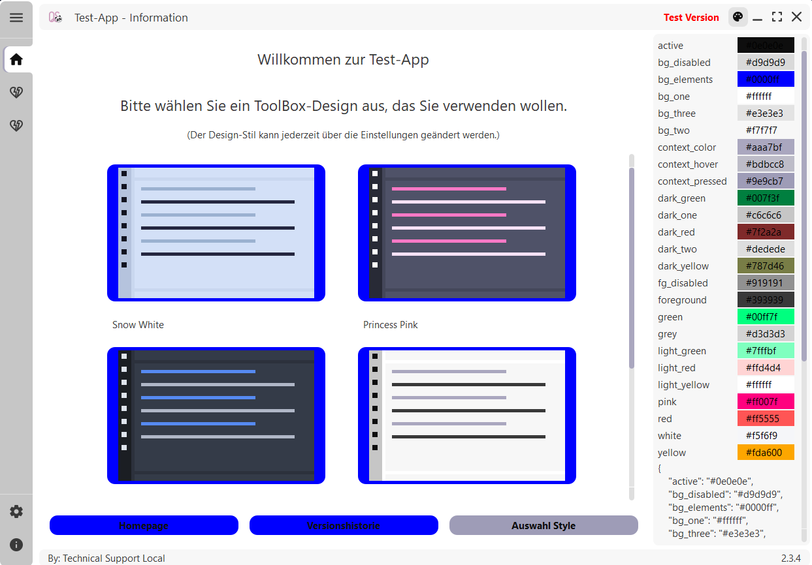

# Style

## Themes

Upon start of the application, the user can select the preferred theme amongst two
darker themes, ```Darcula``` and ```Princess Pink```, two light themes, ```Highbridge Grey``` and ```Snow White```,
and the colorful theme ```Ruby Red```.



Additionally, the colors of the themes can be adjusted or new ones created. For this purpose open the
color picker and select the colors to be adjusted. For example, changing ```bg_elements``` to a dark blue:



## Icons and Images

To handle the color of icons and their size during runtime two features are used.
First, the custom implementation of the IconEngine enables the usual use of QIcon. Secondly, the
created QPixmaps are saved in a dictionary such that they are only created once during runtime.

### CustomIconEngine
The CustomIconEngine ensures that the Icons are painted in the correct color. If paint is called
the engine retrieves the [pixmap from the store](#pixmapstore) in the color according to the currently set theme (```get_color``` via color name) and size.
The engine adjusts the size to the present pixel-ratio, so that if the screen's resolution changes, the display of the icon
remains sharp. The override method ```pixmap``` sets a transparent background for icons, because the default painter has no alpha channel.

Use the CustomIconEngine as follows and make sure the ```color_name``` (for example "foreground") exists in the style definition:
```plaintext
    icon = QIcon(CustomIconEngine(":/path_to_icon.svg", "color_name"))
```

### PixmapStore

The PixmapStore is a global handler for commonly used icons. To use, get the current instance with ```PixmapStore.inst()``` and call
```get_pixmap``` for the desired icon.

```plaintext
    pixmap = PixmapStore.inst().get_pixmap(
            ":/path_to_icon.svg", width, height, color
        )
```
To keep the original color, set ```color=None```.

The store first checks, if a pixmap with this path, size and color has been created before. If so, this pixmap is returned,
otherwise a new pixmap will be drawn in correct size and color, and finally saved in the class`s dictionary.

Attention: The pixmap store does not handle pixel-ratio or theme related issues. Make sure you ask for the correct color (hexcode) and dimensions.

### Resources

To make all images available, one can create a new resource_rc.py file by running the script generate_rc.py.
The script handles the creation of resources.qrc, by adding everything in the qute_style/resources directory and its subfolders.
It automatically converts it into resource_rc.py and deletes resources.qrc, finally. Like this
any icon inside the resources' folder can be accessed via its path within this folder, for example:

```plaintext
    accept_path = ":/svg_icons/accept.svg"
```
