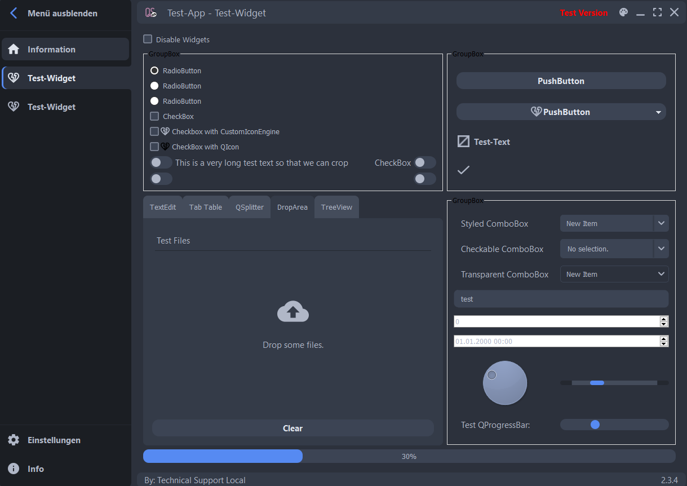
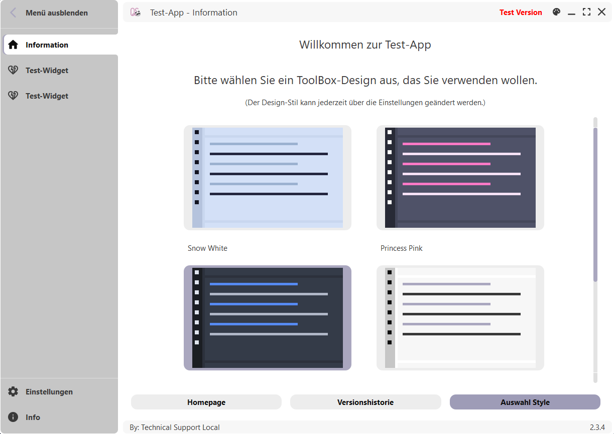

# Style

## Themes
### Darcula


### Highbridge Grey


### Princess Pink


### Snow White


### Ruby Red

## Icons and Images

To handle the color of icons and their size during runtime two features are used. 
First, the new implementation of the IconEngine enables the usual use of QIcon. Secondly, the
created QPixmaps are saved in an Dictionary such they are only created once during runtime.

### CustomIconEngine
The CustomIconEngine ensures that the Icons are painted in the correct color. If paint is called
the engine retrieves the [pixmap from the store](#pixmapstore) in the color according to the currently set theme (get_color via color name) and size.
The engine adjusts the size to the present pixel-ratio, so that if the screen's resolution changes, the display of the icon
remains sharp. The override method pixmap sets a transparent background for Icons, because the default painter in pixmap has no alpha channel.

Use the CustomIconEngine as follows and make sure the "color_name" (for example "foreground") exists in the style definition:
```plaintext
    icon = QIcon(CustomIconEngine(":/path_to_icon.svg", "color_name"))
```

### PixmapStore

The PixmapStore is a global handler for commonly used icons. To use, get the current instance with PixmapStore.inst() and call
get_pixmap for the desired icon.

```plaintext
    pixmap = PixmapStore.inst().get_pixmap(
            ":/path_to_icon.svg", width, height, color
        )
```
To keep the original color, set ```color=None```.

The store first checks, if a pixmap with this path, size and color has been created before. If so, this pixmap is returned, 
otherwise a new pixmap will be drawn in correct size and color, and finally saved in the dictionary self._pixmaps.

Attention: The pixmap store does not handle pixelratio or theme related issues. Make sure you ask for the correct color (hexcode) and dimensions.

### Resources

To make all images available, one can create a new resource_rc.py file by running the script generate_rc.py. 
The script handles the creation of resources.qrc, by adding everything in the qute_style/resources directory and its subfolders.
It automatically converts it into resource_rc.py and deletes resources.qrc, finally. Like this
any icon inside the resources' folder can be accessed via its path within this folder, for example:

```plaintext
    str_path = ":/svg_icons/accept.svg"
```
