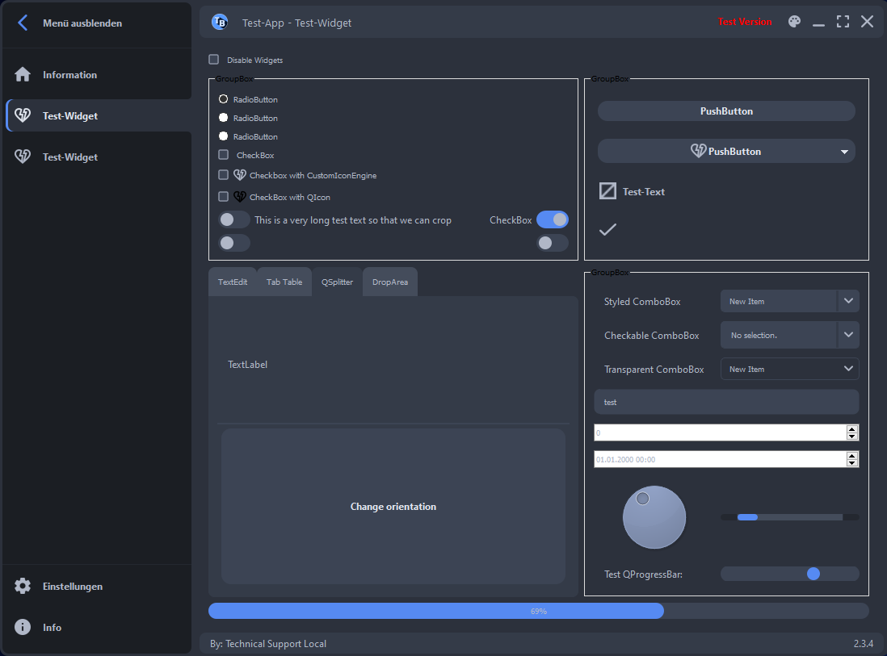
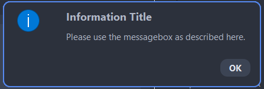
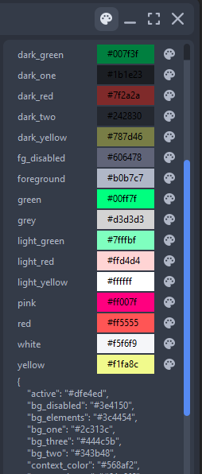
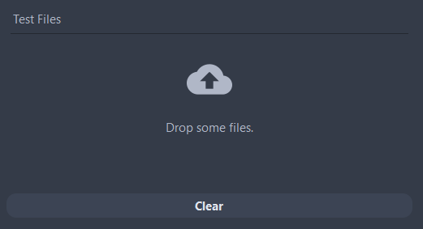

# Widgets

- [BaseWidgets](#basewidget)
  - [MainWidget](#mainwidget)
  - [SettingsBaseWidget](#settingsbasewidget)
- [QuteMessageBox](#qutemessagebox)
- [Color Manager](#color-manager)
  - [ColorWidget](#colorwidget)
  - [ColorManager](#colormanager)
- [ComboBox](#combobox)
  - [StyledComboBox](#styledcombobox)
  - [CheckableComboBox](#checkablecombobox)
- [TextTruncator](#texttruncator)
- [Toggle](#toggle)
- [Buttons](#buttons)
  - [Icon](#icon)
  - [DropLabel](#droplabel)
  - [IconButton](#iconbutton)
  - [IconTooltipButton](#icontooltipbutton)
  - [LeftMenuButton and TitleButton](#leftmenubutton-and-titlebutton)


Many of our custom widgets can be found in the Test-Application:



## BaseWidget

The BaseWidget aims to define the properties ICON, NAME and GROUPS.
The Icon and the name will be displayed at the left column of the application.
By setting the target group, the developer can specify for which User/Group the widget will be visible.

### MainWidget

The MainWidgets are displayed in the main section. The class provides basic functionalities, such as shutdown and custom widget settings.

The shutdown of the whole application waits for all MainWidgets to emit the signal shutdown completed.
To implement custom shutdown behaviour one needs to override ```request_shutdown``` or ```shutdown```.

To display MainWidget specific settings, one can implement a Widget and return it as the settings_widget property of the MainWidget.
The specific settings are then added to the global settings, and only displayed if the user activated the associated MainWidget
(see [SettingsBaseWidget](#settingsbasewidget) for more details).

### SettingsBaseWidget

Serves as BaseClass for the global settings. To have settings displayed independent of the active MainWidget, set the widget into the layout with
```_set_global_widget```. When the user activates a new widget ```on_main_wigdet``` or chooses to display the settings, the SettingsBaseWidget
is cleared first, ```clear_widget```. Then, if local settings are available, they are added ```add_widget```.

## QuteMessageBox

The QuteMessageBox can display four types of messages. The general style (i.e. background color, layout and frame)
is the same, and all use the same functionality for their display. Via ```_show_message_box``` their message with
individual title, text, icon, and buttons is shown. The following types are available as a class property.

- Information
- Warning
- Critical
- Question

Example:

```plaintext
    QuteMessageBox.information(
                self,
                "Information Title",
                "Please use the messagebox as described here.",
            )
```



## Color Manager

### ColorWidget

This widget displays a color with an associated palette-button, to open the QColorDialog and pick a new color.
When the color was changed, the widget emits ```color_changed``` signal, such that the application can update this color in use.

### ColorManager

A BaseWidget, that can be used to change and test the different color properties of the application.
For each color key in the style (i.e. background-color, foreground, ...) an instance of [ColorWidget](#colorwidget) is created.
Now the user can adjust single colors to his interest by clicking on the palette icon and choosing the desired color.
When the ColorManger receives a ```color_changed``` signal, the slot ```on_color_changed```
is activated, a new theme is created, and the window is updated.
The paintEvent checks whether the theme has changed before painting.
For reusing a newly created color scheme, the dictionary can be copied and defined as a new [theme](./style.md#themes) in the style.



## ComboBox

### StyledComboBox

The StyledComboBox implements a custom drawing of the dropdown arrow compared to the standard QComboBox.
For this purpose, we first draw the QComboBox within the ```paintEvent``` with the
specifications set in the stylesheet by calling ```super().paintEvent(event)```. Next, the
color for the arrow is retrieved depending whether the ComboBox is enabled or not. Now, the rectangle for drawing
is defined through the subcontrol of the style. The radius of the arrow pixmap is calculated using the rectangle width and the current
device`s pixelratio. The [PixmapStore](./style.md#pixmapstore) delivers a pixmap, which is then painted over the
existing arrow.

### CheckableComboBox

The Style of the CheckableComboBox is inherited from the StyledComboBox. The widget enables the user to select,
one or many items from the dropdown-menu. Per default, multiple items can be selected, to change this set ```single_mode = True```.
To retrieve information about the current selected items or to select multiple items programmatically use the getter and setter method
```item_ids```. It can be useful to further subclass CheckableComboBox, for example:
```plaintext
    class StateCombobox(CheckableComboBox[int]):
        """Combobox that displays a list of States to be checked."""

        def __init__(self, parent: QWidget = None) -> None:
            """Create CheckableComboBox with state items."""
            super().__init__(parent)
            self._default_text = "No state selected"
            self.single_mode = True

            # Add states items
            self.addItem("State 1", 1, ":/state1.svg", "foreground")
            self.addItem("State 2", 2, ":/state2.svg", "foreground")
            self.addItem("State 3", 3, ":/state3.svg", "foreground")

        def _get_text(self) -> str:
            """Return the text that is shown at the top of the combobox."""
            for idx in range(self.model().rowCount()):
                if self.model().item(idx).checkState() == Qt.Checked:
                    return self.model().item(idx).text()
            return self._default_text
```
Like in the example, the datatype of the items (```int```) needs to be specified. The items are added inside the init construction,
the icons are optional and displayed next to the checkboxes. With a custom ```_get_text``` method, the selected item is displayed
as "State 1" instead of "1", since the default implementation returns the data and not the text.

## TextTruncator

TextTruncator is a widget that is able to truncate and store texts. This is very useful to increase the paint performance of models with lots of data.
The class is intended to be used as a mixin for classes that will need to truncate their texts and store them as a QStaticText.
Such classes are [Toogle](#toggle) or custom QStyledItemDelegate with custom ```paint``` method.
Inside such a paint method, the truncator could be used as follows:

```plaintext
    text = self.truncate_text(text, width, painter.fontMetrics())
    painter.drawStaticText(x_pos, y_pos, text)
```

## Toggle

The toggle behaves like a QCheckBox. In comparison to the QCheckBox, there exists no Tristate.
It overrides the implementation of ```hitButton``` and ```paintEvent```. Now, if the user hits the toggle,
the ```state_changed``` signal is connected to an animation slot, which calculates the new position of the
toggle-circle. If a paint event is triggered, the ToggleOptionButton as implemented in the custom [qute style](./style.md#style)
is used for drawing.

## Buttons
Several types of custom Buttons are implemented for higher conformity with the application's style.

### Icon
The Icon class is used for the LeftColumnButton but also as a base for custom buttons. The user needs to define size, color name
and the icon path. The Icon can be used directly in the ui-file, and the path can be set later. If a paint event occurs,
the class calculates the size according to the device's pixel ratio and retrieves the theme's color information. Then it gets
the QPixmap from the [PixmapStore](./style.md#pixmapstore).

```plaintext
    icon = Icon(18, "background")
    icon.set_icon(":/path_to_icon.svg")
````

Attention: The Icon class inherits from QWidget, not QIcon.

### DropLabel

The DropLabel offers a convenient way to display the cloud icon with an associated text and for example
connect it with an event filter, that handles events of type ```QEvent.Drag``` and ```QEvent.Drop```:

```plaintext
    drop_label = DropLabel("Drop some files.", drop_widget)
    drop_widget.installEventFilter(drop_widget)
```



### IconButton

The IconButton is a QPushButton, which can display an icon with text and implements custom hover, pressed and released behaviour.
This Button can be used as a standalone (see example). Additionally, it serves as a super class for other custom buttons.

```plaintext
    button = IconButton(parent)
    button.set_icon(":/svg_icons/accept.svg")
    button.setText("Accept")
```

The default colors of the IconButton are defined via the BackgroundColorNames, which can be set also during instantiation:

```plaintext
    BackgroundColorNames(
        hovering="bg_elements",
        background="transparent",
        pressed="dark_two",
        released="bg_elements",
    )
```

The color of icon and text is defined as ```foreground```. To change text or icon later on, use the methods ```setText```and ```set_icon```.
This allows to use the IconButton as a placeholder in the ui-files.

### IconTooltipButton

The behaviour of the IconTooltipButton is similar to the IconButton, with the addition of showing a custom ToolTip.
It serves as a superclass for [TitleButton](#titlebutton) and [LeftMenuButton](#leftmenubutton), which need to implement ```_get_tooltip_coords```
individually. One can set the tooltips via ```tooltip_text```.

### LeftMenuButton and TitleButton

The LeftMenuButton is a core element of the LeftMenu. The LeftMenu displays the buttons, which are associated with widgets, and
the user can access these widgets by pressing the button. An animation expands/collapses the menu, therefore,
the ```paintEvent``` handles two animation states, as well as hover, clicked, and pressed states.
